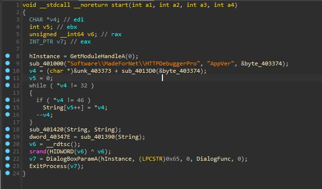
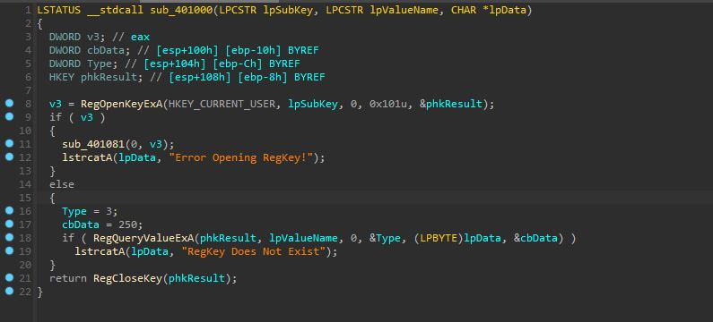
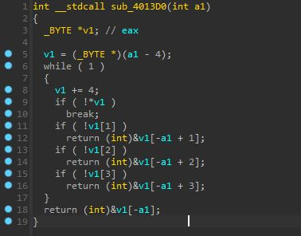
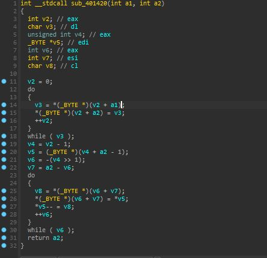
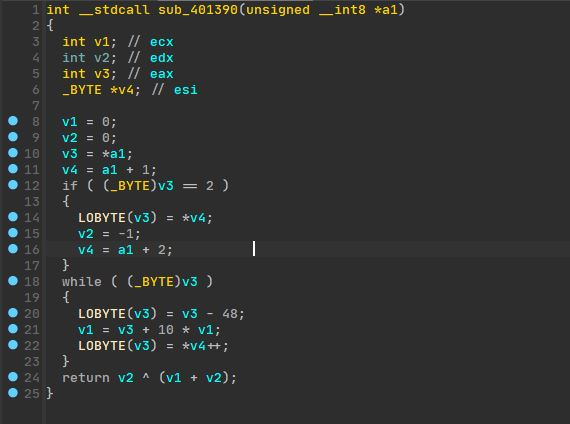
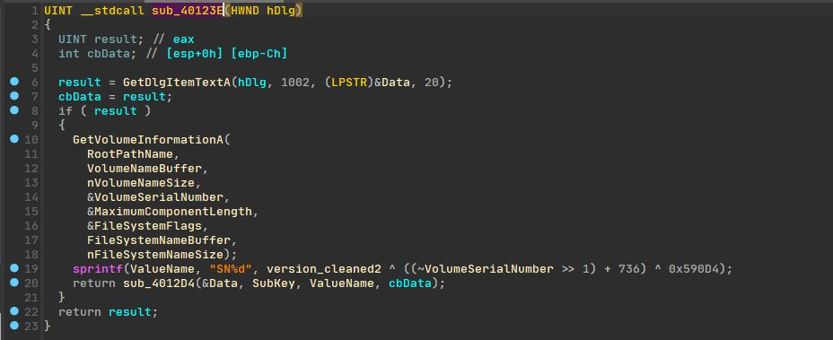
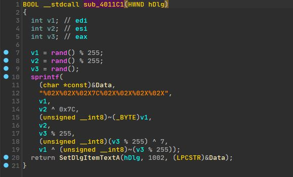
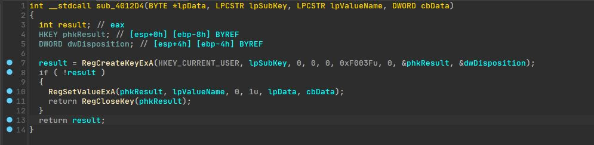

+++
title = "Keygen Analizi - Bölüm 1"
description = "Bir keygeni IDA Pro ve x64dbg ile analiz edip Rust ile baştan yazıyoruz - Bölüm 1"
date = "2022-09-11"
draft = false
[taxonomies]
tags = ["reversing", "turkish"]
+++

## Giriş
Http Debugger Pro kullanırken yenik düştüğüm merakım yüzünden bu gönderiyi yazıyorum

kendileri yaparak takip etmek isteyenler için:

Dosya: https://cloud.disroot.org/s/w33G9eCFne9NibH

VT: https://www.virustotal.com/gui/file/2234957b4842355a4c3d1295dd9d89c9cb0949a15ad41ddee30cf93c62c8b0e2

## İlk Bakış
Dosyayı IDA'ya atıp start fonksiyonunu decompile edelim bakalım neler dönüyor..


Diğerlerini bilmem ama sub_401000 kesinlikle kayıt defteri ile alakalı bişeyler yapıyor daha detaylı inceleyelim

## sub_401000


Tam da düşündüğüm gibi ilk verilen argümanı "subkey" ikinciyi değer adı olarak kullanarak uygulama versiyonunu üçüncü argümana yazıyor. Benim bu gönderiyi yazarken kullandığım sürümde yazan değer "HTTP Debugger 9.0.0.12" şeklinde, bakalım bu veri nasıl kullanılıcak. Fonksiyonu get_app_version, üçüncü argümanı app_version olarak yeniden adlandırıp devam ediyorum

## sub_4013D0


Bu arkadaşımız bir sonraki çağrılan fonksiyon, uygulama versiyonunu ise argüman olarak alıyor. Buna bir süre boş boş baktıktan sonra bunu (şimdilik) statik olarak anlamaya çalışıcak kadar ruh hastası olmadığıma karar verdim x64dbg üzerinden devam ediyoruz :D

## sub_4013D0 Dinamik Analiz

<video width=100% controls>
    <source src="./img/sub_4013D0.mp4" type="video/mp4">
    Your browser does not support the video tag.  
</video>

Burdan anladığım kadarıyla uygulama versiyonunun son 2 sayısını döndürüyor ama içimde bişey kaçırıyormuşum gibi bir his var yine de devam edelim

## While döngüsü
```c
while ( *v4 != 32 )
{
    if ( *v4 != 46 )
      String[v5++] = *v4;
    --v4;
}
```
şeklinde bi döngümüz var, sıçtık galiba... Bir önceki fonksiyonun char* döndürdüğünü gördüğümde IDA yanlış decompile etmiştir diyip geçmiştim ama harbiden yazı döndürüyor gibi 32 ve 46 ASCII'de  sırasıyla boşluğa ve nokta karakterine denk geliyor yani bi önceki fonksiyonun son 2 sayıyı değil "HTTP Debugger" kısmını silip sadece 9.0.0.12 döndürüyor olması çok kuvvetli ihtimal. Fonksiyonun 9.0.0.12 döndürdüğünü varsayıp devam edelim. Bu kod parçası nokta karakteri olmayan her karakteri String isimli bir değişkene koyuyor ve sonuç olarak 9.0.0.12 değeri 90012 oluyor, Bu değişkeni version_cleaned olarak yeniden adlandırıp devam ediyorum

Sonradan gelen not: Bu kod yanlış decompile edilmiş ++v4 olması gerekiyor assembly'e göre.

Okuyucuya not: Kafanızı monitöre vurmadan önce decompilerlara güvenilmemesi gerektiğini öğrenin.

## sub_401420


Hiçbir şey dememe gerek yok x64dbg üzerinden devam ediyoruz :D

## sub_401420 Dinamik Analiz

<video width=100% controls>
    <source src="./img/sub_401420.mp4" type="video/mp4">
    Your browser does not support the video tag.  
</video>

Bu kanser şeyin sırf benim gibilere vakit kaybettirmek için konulduğuna %99,99 eminim noktasız versiyon değeri geri dönüyor, devaaam

## sub_401390


Yine zamanım çalınıcak gibi hissediyorum ama x64dbg geçtik yine

## sub_401390 Dinamik Analiz

<video width=100% controls>
    <source src="./img/sub_401390.mp4" type="video/mp4">
    Your browser does not support the video tag.  
</video>

Ömrümü yediğim şeye bak amk yine versiyon döndürdü neyse devam ediyoruz

## sub_40123E


Bak bu ilginçmiş işte C diskinin seri numarasını çekip SN ile başlayan bir yazıya seri numarası ve uygulama versiyonunu içeren bir dizi bit işlemine sokuyor ve değer ValuName isimli değişkene atanıyor. Bu kısım büyük ihtimal direkt Http Debugger analiz edilerek bulundu, bizi sinir krizine girmek zorunda bırakmadıkları için teşekkür ediyor ve devam ediyoruz

## sub_4011C1


Sonunda lisans üretimine gelebildik çok da fantazili bişeyler yokmuş hayal kırıklığına uğramadım desem yalan olur :D

3 adet 0 ile 254 arası sayı üretiliyor ve değişik bit işlemlerinin değerleri hex olarak Data isimli değişkene atanıyor

## sub_4012D4


Burada ValueName kayıt defterinde isim Data ise onun değeri olarak kullanılarak kayıt defterine yazılıyor


## Sondaki Küçük Kod Parçacığı
```c
v6 = __rdtsc();
srand(HIDWORD(v6) ^ v6);
```
Bunun sayesinde iki satırda iki farklı şey öğrendim;
- __rdtsc fonksiyonu Windows makinelerde rtdsc assembly komutununu üretmeye yarıyormuş bu ise son yeniden başlatmadan sonra geçen işlemci döngü sayısını veriyormuş
- HIDWORD makrosu bir DWORD'ün son 2 baytını getirmeye yarıyormuş

Yani bu kod parçası rastgele olma olasılığı çok yüksek olan bir değeri alıp bu değeri son 2 baytı ile XOR işlemine sokup gelen veriyi rastgele sayı üreticiye "seed" olarak kullanıyor. time(NULL) kullanan eziklere duyurulur :D

## Çıkış
Şimdilik bu kadar bölüm ikide burdan öğrendiklerimizi kullanarak Rust ile baştan keygen yazmaya çalışıcaz

Bu arada temizlenilmiş IDB dosyası için: https://cloud.disroot.org/s/cMR8J3FTzaxqcMJ